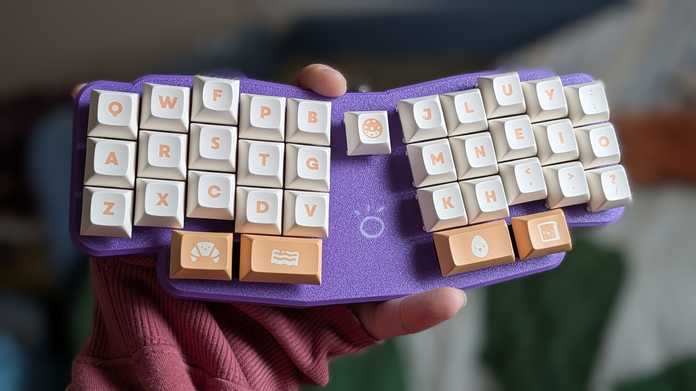

# toki 
«toki» li poki pona lili pi ilo toki «Le Chiffre»

## what
toki is a small, minimal case for (the) Le Chiffre keyboard. the toki pona word "toki" means "communicate, say, think; conversation, story; language" (according to [nimi.li](https://nimi.li)) [toki pona](https://tokipona.org/#about) is a tiny little conlang. 

## okay
- this case is a friction fit with short pegs on the bottom fitting into holes on the top. it is possible to pry it open after assembly with a thin tool (a guitar pick can work), but it's not easy. be careful with your pcb.
- there are no notches for MX switches to clip in to, they're just 14mm squares (sorry)
- bottom row supports 34-key and 36-key layout

## sitelen
the "withlogo" step file (not present in the stl) has the small toki symbol as an embedded object so it can be printed in a different color (with a bambu ams, for instance).

